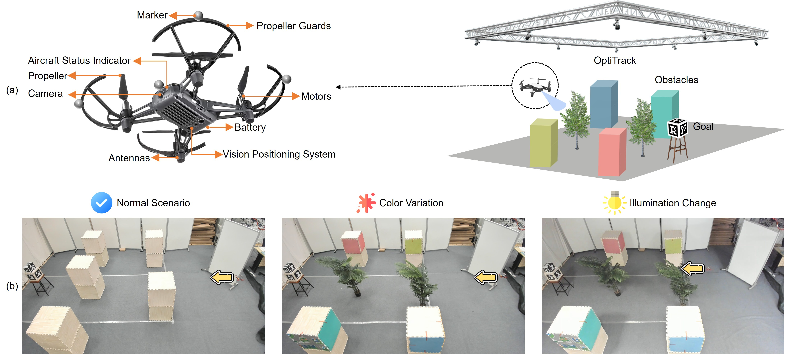

# OMC-RL: Oracle-Guided Masked Contrastive Reinforcement Learning for Visuomotor Policies

This repository contains the code and resources for our paper **"Oracle-Guided Masked Contrastive Reinforcement Learning for Visuomotor Policies"** (under review). We propose a novel two-stage framework for learning robust UAV visuomotor policies under severe domain shifts, combining masked contrastive learning and oracle-guided reinforcement learning.

  

<b>Figure 1:</b> The framework of OMC-RL

## 🚁 Real-World Deployment

  

<b>Figure 2:</b> Real-world deployment setup and evaluation scenarios

    
   
  

<b>Figure 3:</b> Real-world trajectory evaluation under visual domain shifts

## 📅 Timeline

| Stage              | Status         |
|--------------------|----------------|
| Paper submission   | ✅ Submitted    |
| Peer review        | ⏳ In progress  |
| Code release       | 🔒 Coming soon |

## 🔒 Code Availability

The code will be released upon acceptance of the paper.

**📌 Project Website:** [https://zzzzzyh111.github.io/OMC-RL-Website/](https://zzzzzyh111.github.io/OMC-RL-Website/)

---

⭐️ Star this repo to stay updated!
